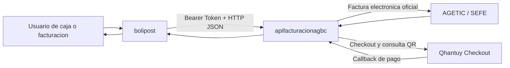
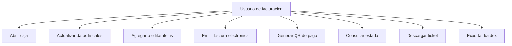
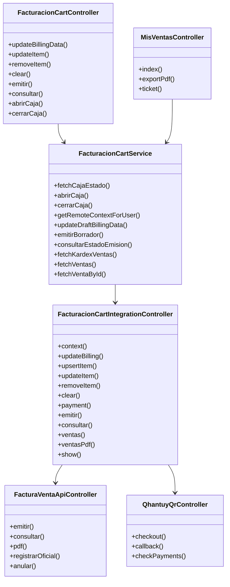
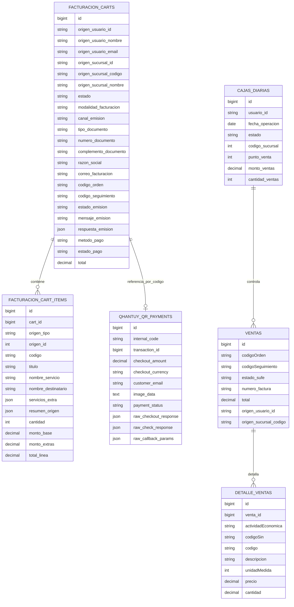
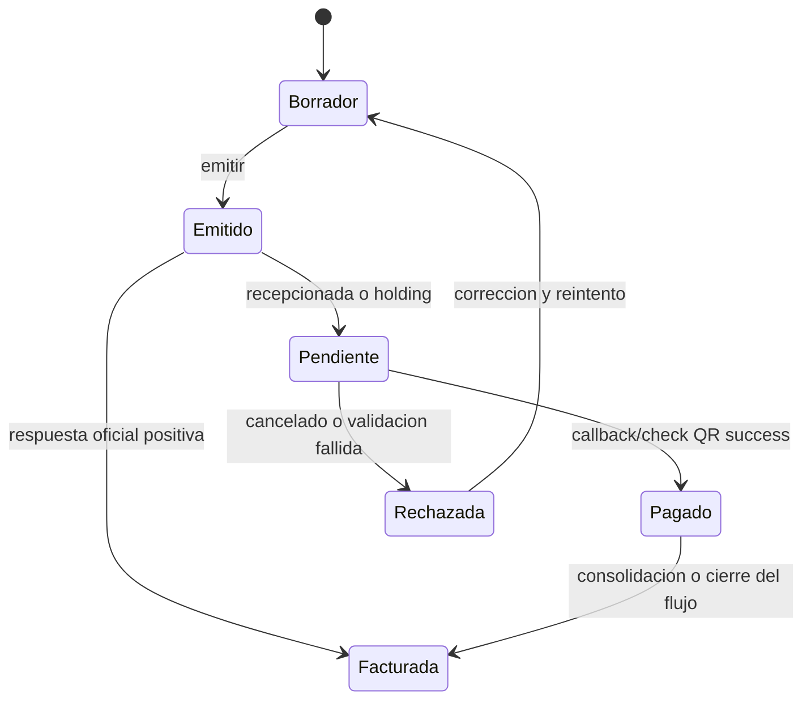
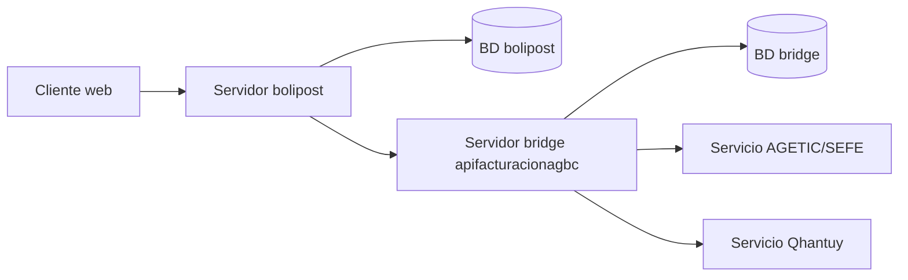
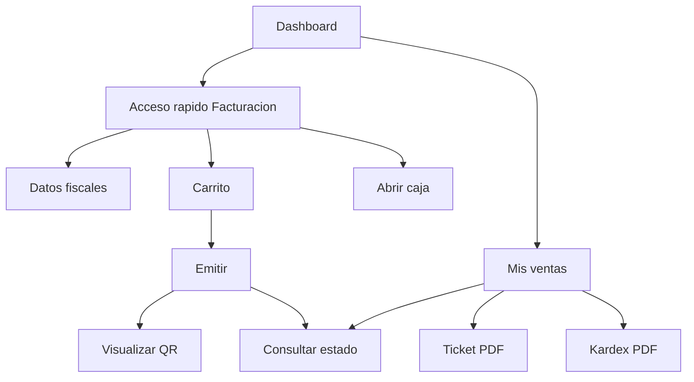
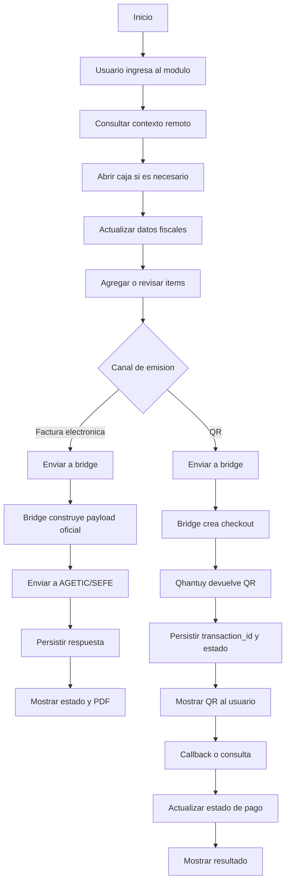

# DOCUMENTO TECNICO

## NOMBRE DEL SISTEMA

"SISTEMA INTEGRAL OPERATIVO POSTAL  
MODULO FACTURACION"

## HECHO POR

Eynar Renan Quispe Crispin  
Telefono: 67140261  
Correo electronico: eynar345@gmail.com  
GitHub: https://github.com/colee615

La Paz - Bolivia  
2026

---

## INDICE

1. Capitulo 1 - Descripcion general del sistema
2. Capitulo 2 - Analisis de requisitos
3. Capitulo 3 - Diseno del sistema
4. Capitulo 4 - Desarrollo e implementacion
5. Capitulo 5 - Pruebas y calidad
6. Conclusiones
7. Recomendaciones
8. Bibliografia
9. Anexos

---

## CAPITULO 1 - DESCRIPCION GENERAL DEL SISTEMA

### 1.1 Descripcion del sistema

El Sistema Integral Operativo Postal - Modulo Facturacion es el subsistema responsable de administrar el proceso de facturacion asociado a operaciones postales, consolidando en una sola experiencia operativa el registro de datos fiscales, la gestion del borrador de venta, la emision de factura electronica y la generacion de cobros electronicos mediante QR.

Desde la perspectiva funcional, el modulo resuelve un problema de integracion entre operacion interna y servicios externos. El usuario trabaja dentro de la interfaz de `bolipost`, pero la logica de integracion no se ejecuta directamente contra todos los proveedores externos; en su lugar, se utiliza una capa intermedia especializada, representada por el proyecto `apifacturacionagbc`, que concentra reglas de emision, persistencia del carrito, control de caja, normalizacion de payloads y sincronizacion de estados.

Esto significa que el modulo no debe entenderse como una simple pantalla de cobro o como un formulario de emision, sino como un flujo transaccional completo con las siguientes responsabilidades:

- administrar un borrador de facturacion reutilizable
- validar y sincronizar datos fiscales del cliente
- relacionar la venta con usuario, sucursal, punto de venta y caja diaria
- decidir el canal de emision segun el caso de uso
- emitir facturacion oficial por medio de AGETIC/SEFE
- generar y consultar pagos QR por medio de Qhantuy
- persistir la respuesta tecnica de cada integracion para fines de auditoria y trazabilidad

Por su alcance y naturaleza, este modulo cumple una doble funcion institucional:

- funcion operativa, porque habilita la emision y cobranza en el trabajo diario
- funcion de control, porque conserva estados, identificadores, historiales y evidencia de integracion

### 1.2 Objetivo tecnico del modulo

El objetivo tecnico del modulo es proporcionar un mecanismo desacoplado, seguro y trazable para integrar la operacion de facturacion postal con servicios oficiales de emision electronica y servicios complementarios de pago QR, minimizando dependencia directa del sistema cliente respecto de APIs externas.

En terminos de arquitectura, esto se traduce en:

- desacoplar interfaz y negocio del detalle tecnico de integracion
- mantener consistencia de datos entre borrador, venta, caja y estado de pago
- encapsular la complejidad de proveedores en una API intermedia
- facilitar mantenimiento, evolucion y observabilidad del proceso

### 1.3 Alcance funcional del componente analizado

El presente documento se concentra exclusivamente en el flujo de integracion de facturacion electronica y pagos QR. Esto incluye:

- actualizacion de datos fiscales
- apertura y cierre de caja
- preparacion del carrito de facturacion
- emision por canal `factura_electronica`
- emision por canal `qr`
- consulta de estado posterior
- generacion de ticket y PDF
- persistencia de trazas de integracion

No se desarrollan en profundidad otros modulos del ecosistema postal, salvo cuando interactuan directamente con el flujo de facturacion, por ejemplo la incorporacion de solicitudes EMS al carrito o el uso de sucursal de facturacion asignada al usuario.

### 1.4 Problema de negocio que resuelve

Antes de una arquitectura de este tipo, el proceso de venta podia fragmentarse en varias etapas poco coordinadas: registro de operacion, definicion de datos fiscales, emision del documento, confirmacion del cobro y verificacion posterior. Cuando esas fases viven en sistemas o procesos inconexos, aparecen riesgos operativos frecuentes:

- duplicidad de emisiones
- pagos sin trazabilidad consolidada
- dificultad de conciliacion entre venta y factura
- reprocesos por caida de servicios externos
- perdida de contexto sobre el estado real de una transaccion

El modulo resuelve ese problema al introducir una entidad central de trabajo: el carrito de facturacion. Sobre esa entidad se soportan decisiones de canal, montos, datos fiscales, estados de pago y referencias tecnicas de seguimiento.

### 1.5 Stack tecnologico

#### Aplicacion cliente `bolipost`

- Lenguaje de programacion: PHP 8.2
- Framework backend: Laravel 12
- Interaccion reactiva: Livewire 3
- Renderizado frontend: Blade
- Tooling frontend: Vite
- Estilos: Tailwind CSS
- Comportamiento cliente ligero: Alpine.js
- Generacion de PDF: `barryvdh/laravel-dompdf`
- Generacion de codigos QR y de barras: `milon/barcode`
- Control de acceso: `spatie/laravel-permission`
- Persistencia principal: PostgreSQL

#### Aplicacion bridge `apifacturacionagbc`

- Lenguaje de programacion: PHP 8.x
- Framework backend: Laravel
- Persistencia relacional administrada por migraciones
- API interna protegida con middleware de autenticacion
- Integracion externa con AGETIC/SEFE
- Integracion externa con Qhantuy Checkout

#### Herramientas y bibliotecas relevantes

- cliente HTTP de Laravel para consumo de APIs
- validacion estructurada de requests
- DomPDF para reportes y tickets
- middleware custom para autenticacion de integracion
- persistencia de respuestas JSON para auditoria

### 1.6 Principios de arquitectura aplicados

La solucion observada en el codigo refleja varios principios de arquitectura de software:

#### Separacion de responsabilidades

`bolipost` resuelve experiencia de usuario, permisos, formularios, feedback, tickets y coordinacion de flujo. `apifacturacionagbc` resuelve persistencia del carrito, transformacion de payloads, control de caja, emision, consulta y callbacks.

#### Desacoplamiento por servicio intermedio

El sistema cliente no depende directamente de la semantica exacta de AGETIC/SEFE ni de Qhantuy. Esto reduce el impacto de cambios en contratos externos.

#### Persistencia de estado transaccional

El carrito y las ventas guardan identificadores como `codigo_orden`, `codigo_seguimiento`, `estado_emision`, `estado_pago` y `respuesta_emision`, permitiendo reanudar o auditar el proceso.

#### Tolerancia a incertidumbre remota

El flujo contempla timeouts, estados pendientes, reconsultas y callbacks, lo que es apropiado cuando se integran servicios externos que no siempre responden de forma inmediata o determinista.

### 1.7 Arquitectura general del sistema

La arquitectura implementada es de tipo cliente-bridge-servicios externos.



#### Descripcion de la arquitectura

1. El usuario opera desde `bolipost`.
2. `bolipost` prepara y sincroniza el borrador con el bridge usando `FACTURACION_BRIDGE_BASE_URL` y `FACTURACION_BRIDGE_TOKEN`.
3. El bridge decide el flujo segun `canal_emision`.
4. Si el canal es `factura_electronica`, construye y envia payload al servicio oficial.
5. Si el canal es `qr`, construye un checkout con `internal_code`, items, cliente y callback.
6. El bridge persiste la respuesta de integracion.
7. `bolipost` consume el estado consolidado y lo presenta al operador.

### 1.8 Beneficios tecnicos de la solucion

- trazabilidad completa de la transaccion
- reusabilidad del carrito como unidad de trabajo
- independencia relativa respecto de proveedores externos
- centralizacion de autenticacion y reglas de integracion
- facilidad para emitir tickets y reportes de ventas
- mejor control de caja y sucursal en el flujo de emision

---

## CAPITULO 2 - ANALISIS DE REQUISITOS

### 2.1 Descripcion del contexto y necesidad

El entorno institucional donde opera el modulo exige tres caracteristicas fundamentales: control, trazabilidad y continuidad operativa. El operador necesita emitir ventas y cobrarlas con rapidez, pero la institucion requiere al mismo tiempo evidencia clara del estado de cada transaccion, del usuario que la ejecuta, de la sucursal involucrada y del servicio externo que la procesó.

La necesidad que da origen a este modulo puede formularse de la siguiente manera: integrar la venta postal con la emision oficial y con el cobro electronico, sin que el usuario deba salir del sistema principal ni depender de verificaciones manuales en plataformas externas.

Desde esa necesidad se derivan las siguientes demandas tecnicas:

- que exista una entidad intermedia reutilizable para preparar la venta antes de emitirla
- que la facturacion pueda operar con datos fiscales completos o con variantes controladas
- que la caja diaria sea una condicion verificable del proceso
- que los estados de pago y emision puedan persistirse y consultarse despues
- que el sistema soporte escenarios asincronos, especialmente en QR

### 2.2 Requerimientos de instalacion y entorno

#### Requerimientos de software

- PHP 8.2 o superior para `bolipost`
- Composer para administracion de dependencias PHP
- Node.js y npm para compilacion frontend
- Motor de base de datos compatible con Laravel
- Servidor Apache, Nginx o entorno local tipo XAMPP
- Acceso a red hacia el bridge y hacia los servicios externos configurados

#### Requerimientos de infraestructura logica

- una base de datos para `bolipost`
- una base de datos para `apifacturacionagbc`
- variables de entorno configuradas correctamente por ambiente
- certificado o configuracion SSL apropiada segun entorno
- cuenta o credenciales de integracion para AGETIC/SEFE
- cuenta o credenciales de integracion para Qhantuy

#### Variables de entorno principales

##### En `bolipost`

- `APP_NAME`
- `APP_ENV`
- `APP_URL`
- `APP_TIMEZONE`
- `DB_CONNECTION`
- `DB_HOST`
- `DB_PORT`
- `DB_DATABASE`
- `DB_USERNAME`
- `DB_PASSWORD`
- `CACHE_DRIVER`
- `QUEUE_CONNECTION`
- `SESSION_DRIVER`
- `FACTURACION_BRIDGE_BASE_URL`
- `FACTURACION_BRIDGE_TOKEN`
- `FACTURACION_BRIDGE_NIT_EMISOR`
- `FACTURACION_BRIDGE_FALLBACK_EMAIL`
- `FACTURACION_BRIDGE_METODO_PAGO`
- `FACTURACION_BRIDGE_FORMATO_FACTURA`
- `FACTURACION_BRIDGE_DOCUMENTO_SECTOR`
- `FACTURACION_BRIDGE_TIMEOUT`
- `FACTURACION_BRIDGE_CONNECT_TIMEOUT`
- `FACTURACION_BRIDGE_SSL_VERIFY`

##### En `apifacturacionagbc`

- `AGETIC_BASE_URL`
- `AGETIC_TOKEN`
- `AGETIC_SSL_VERIFY`
- `FACTURACION_INTEGRATION_TOKEN`
- `FACTURACION_INTEGRATION_USUARIO_ID`
- `QHANTUY_CHECKOUT_BASE_URL`
- `QHANTUY_CHECK_PAYMENTS_URL`
- `QHANTUY_CHECKOUT_TOKEN`
- `QHANTUY_CHECKOUT_APPKEY`
- `QHANTUY_CHECKOUT_CALLBACK_URL`
- `QHANTUY_CHECKOUT_IMAGE_METHOD`
- `QHANTUY_CHECKOUT_CURRENCY_CODE`
- `QHANTUY_CHECKOUT_TIMEOUT`
- `QHANTUY_CHECKOUT_SSL_VERIFY`

#### Consideraciones de configuracion

- no se deben publicar tokens ni appkeys en documentacion abierta
- la URL del bridge debe apuntar al prefijo correcto expuesto por la API
- la sucursal del usuario es un dato critico para resolver `codigoSucursal` y `puntoVenta`
- timeouts mal configurados pueden producir reintentos peligrosos sobre una emision ya iniciada

### 2.3 Requerimientos funcionales

Los requerimientos funcionales se desarrollan a partir del comportamiento real observado en controladores, servicios y persistencia.

#### RF-01 Gestion de borrador de facturacion

El sistema debe crear, recuperar, actualizar y vaciar un borrador de facturacion por usuario de origen. Ese borrador debe conservar items, montos, datos fiscales y estado de emision.

#### RF-02 Sincronizacion de datos fiscales

El sistema debe permitir actualizar:

- modalidad de facturacion
- canal de emision
- tipo de documento
- numero de documento
- complemento
- razon social
- correo de facturacion

#### RF-03 Gestion de items del carrito

El sistema debe permitir agregar, editar y eliminar items del borrador, recalculando cantidad, subtotal, extras y total.

#### RF-04 Control de caja diaria

El sistema debe consultar el estado de caja, permitir apertura y cierre, y validar su existencia antes de ejecutar determinados procesos de emision.

#### RF-05 Emision por factura electronica

Cuando el canal sea `factura_electronica`, el sistema debe enviar la venta al flujo oficial y almacenar:

- codigo de orden
- codigo de seguimiento
- estado de emision
- mensaje devuelto
- respuesta completa

#### RF-06 Emision por QR

Cuando el canal sea `qr`, el sistema debe crear una orden de cobro QR, almacenar `transaction_id`, el QR devuelto y el estado de pago.

#### RF-07 Consulta de estado

El sistema debe permitir consultar el estado posterior de una venta emitida, diferenciando entre flujo oficial y flujo QR.

#### RF-08 Ticket y reporte

El sistema debe generar ticket PDF por venta y kardex PDF de ventas consultadas.

#### RF-09 Trazabilidad de usuario y sucursal

Toda emision debe registrar relacion entre usuario, sucursal, punto de venta y venta emitida.

#### RF-10 Integracion con solicitudes o ventas origen

El sistema debe permitir que otras operaciones del ecosistema postal, como ciertas solicitudes EMS, alimenten el carrito de facturacion.

### 2.4 Requerimientos no funcionales

#### RNF-01 Seguridad

El acceso al modulo debe restringirse a usuarios con permiso `feature.dashboard.facturacion`. Los endpoints del bridge deben exigir autenticacion por token de integracion o token administrado.

#### RNF-02 Disponibilidad operativa

El sistema debe seguir siendo util incluso si el proveedor remoto demora, devolviendo mensajes de reconsulta y evitando reprocesos ciegos.

#### RNF-03 Integridad transaccional

El sistema debe persistir informacion suficiente para reconstituir el estado de una venta, incluso si la respuesta final no es inmediata.

#### RNF-04 Observabilidad

La solucion debe permitir identificar:

- usuario emisor
- sucursal y punto de venta
- canal de emision
- estado remoto
- codigo de orden
- codigo de seguimiento o transaction_id

#### RNF-05 Mantenibilidad

La integracion debe estar encapsulada de modo que los cambios de proveedores o contratos no afecten directamente a toda la interfaz del sistema cliente.

#### RNF-06 Rendimiento razonable

Las consultas y emisiones deben trabajar con timeouts configurables y respuestas paginadas en historiales y kardex.

#### RNF-07 Compatibilidad

La solucion debe operar con stack Laravel moderno y coexistir con otros modulos del sistema sin romper permisos ni navegacion general.

### 2.5 Historias de usuario

#### HU-01 Actualizacion fiscal

Como operador de facturacion, quiero editar los datos fiscales del cliente antes de emitir, para asegurar que la factura o el cobro se generen con informacion valida.

#### HU-02 Seleccion de canal

Como operador de caja, quiero elegir entre `factura_electronica` y `qr`, para adaptar la emision al mecanismo de cobro o atencion requerido.

#### HU-03 Control de caja

Como usuario autorizado, quiero abrir caja antes de emitir ventas, para que el proceso se registre dentro del control operativo diario.

#### HU-04 Consulta posterior

Como usuario autorizado, quiero consultar el estado de una transaccion, para saber si fue facturada, quedo pendiente, fue pagada o fue rechazada.

#### HU-05 Control tecnico de integraciones

Como administrador tecnico, quiero centralizar la logica de integracion en un bridge, para reducir acoplamiento y facilitar mantenimiento.

#### HU-06 Evidencia de operacion

Como responsable de seguimiento, quiero obtener ticket y kardex, para contar con respaldo documental de las operaciones realizadas.

### 2.6 Cronograma de desarrollo

El cronograma siguiente es referencial y esta formulado desde una perspectiva de implementacion incremental coherente con la arquitectura observada.

| Fase | Entregable principal | Duracion estimada |
|---|---|---|
| 1 | Analisis del proceso de facturacion y caja | 1 semana |
| 2 | Diseno del modelo `facturacion_carts` y `facturacion_cart_items` | 1 semana |
| 3 | Desarrollo del acceso rapido y gestion del borrador | 1 semana |
| 4 | Integracion cliente-bridge con autenticacion | 1 semana |
| 5 | Integracion oficial con AGETIC/SEFE | 1 semana |
| 6 | Integracion QR con checkout, callback y consulta | 1 semana |
| 7 | Reportes, ticket, kardex y flujo de consultas | 1 semana |
| 8 | Pruebas integradas, ajuste y documentacion | 1 semana |

### 2.7 Restricciones y dependencias externas

El proyecto presenta restricciones tecnicas relevantes:

- depende de disponibilidad del bridge para operar
- depende de AGETIC/SEFE para emision oficial
- depende de Qhantuy para cobro QR
- depende de sucursal configurada en el usuario
- depende de apertura de caja para algunos flujos
- depende de conectividad de red y timeouts apropiados

Estas restricciones no invalidan la solucion; por el contrario, definen el contexto real en el que debe diseñarse una integracion robusta.

---

## CAPITULO 3 - DISENO DEL SISTEMA

### 3.1 Estructura del proyecto (carpetas y archivos)

#### Estructura principal en `bolipost`

```text
app/
  Http/
    Controllers/
  Livewire/
  Models/
  Services/
  Support/
resources/
  views/
    facturacion/
    partials/
routes/
  web.php
config/
  services.php
```

#### Archivos clave en `bolipost`

- `app/Services/FacturacionCartService.php`
  Rol: cliente de integracion hacia el bridge, normalizacion de payloads, caja, borrador y consulta.

- `app/Http/Controllers/FacturacionCartController.php`
  Rol: coordinador del flujo web, validacion de formularios, feedback al usuario y sesion de QR.

- `app/Http/Controllers/MisVentasController.php`
  Rol: historial de ventas, kardex, ticket PDF y consolidacion de informacion de consulta.

- `resources/views/partials/facturacion-shortcut.blade.php`
  Rol: interfaz principal del acceso rapido de facturacion.

- `resources/views/facturacion/mis-ventas.blade.php`
  Rol: vista de historial, filtros y acciones sobre ventas emitidas.

#### Estructura principal en `apifacturacionagbc`

```text
app/
  Http/
    Controllers/
    Middleware/
database/
  migrations/
routes/
  api.php
config/
  services.php
```

#### Archivos clave en `apifacturacionagbc`

- `app/Http/Controllers/FacturacionCartIntegrationController.php`
  Rol: eje central del carrito de facturacion remoto.

- `app/Http/Controllers/FacturaVentaApiController.php`
  Rol: integracion con facturacion oficial.

- `app/Http/Controllers/QhantuyQrController.php`
  Rol: integracion QR, checkout, consulta y callback.

- `app/Http/Middleware/AuthenticateFacturaVenta.php`
  Rol: autenticacion de endpoints del bridge.

### 3.2 Diseno logico del flujo

El diseño del flujo parte de una premisa importante: la venta no se emite como accion aislada, sino como resultado de un contexto previamente preparado. Ese contexto es el carrito remoto, el cual actua como agregado funcional de:

- identidad del usuario emisor
- identidad de sucursal y punto de venta
- datos fiscales
- items de venta
- configuracion del canal
- historial de emision

En consecuencia, la emision no es un simple `POST` directo al proveedor. Primero se consolida el estado del carrito; luego se decide el canal; despues se construye el payload adecuado para el servicio correspondiente.

### 3.3 Diagrama de casos de uso



### 3.4 Diagrama de clases



### 3.5 Modelo entidad-relacion (MER)



### 3.6 Analisis del modelo de datos

#### `facturacion_carts`

Es la tabla mas importante del flujo remoto. Modela la unidad de trabajo de facturacion y permite mantener el estado entre interacciones de usuario y respuestas remotas. Su diseño refleja varias decisiones correctas:

- separar claramente la identidad del usuario origen
- separar claramente la identidad de sucursal origen
- conservar el canal de emision y el estado de pago
- almacenar el cuerpo completo de la respuesta remota
- soportar totales acumulados del carrito

#### `facturacion_cart_items`

Representa el detalle mutable del borrador. Cada item mantiene un `resumen_origen` que funciona como snapshot tecnico del servicio o producto facturable, incluyendo datos SIN necesarios para la emision.

#### `ventas` y `detalle_ventas`

Son las tablas de consolidacion de la emision oficial. Mientras el carrito representa una intencion de venta en trabajo, `ventas` representa la persistencia de la transaccion emitida o registrada dentro del flujo de facturacion.

#### `qhantuy_qr_payments`

Es una tabla especializada para integracion QR. Su diseño es correcto porque conserva tanto datos de negocio como evidencia de integracion:

- identificador interno
- identificador remoto
- estado de pago
- QR devuelto
- payloads raw de checkout, consulta y callback

### 3.7 Diagrama de estados



#### Interpretacion del diagrama

El modelo de estados no es completamente lineal. En especial en QR, la emision inicial no implica pago final; por eso el sistema necesita distinguir entre:

- estado del carrito
- estado de emision
- estado de pago

Esta separacion evita errores de interpretacion operativa. Una orden QR puede haberse generado exitosamente y aun no estar pagada; del mismo modo, una respuesta oficial puede haber sido recepcionada pero no facturada aun.

### 3.8 Diagrama de secuencia

```mermaid
sequenceDiagram
    participant U as Usuario
    participant B as bolipost
    participant A as bridge
    participant S as AGETIC/SEFE
    participant Q as Qhantuy

    U->>B: Abre modulo y completa datos
    B->>A: GET /cart/context
    A-->>B: draft + last
    B->>A: PUT /cart/billing
    A-->>B: cart actualizado
    B->>A: POST /cart/emitir
    alt canal factura_electronica
        A->>S: emitir(payload oficial)
        S-->>A: codigoSeguimiento + estado + factura
        A-->>B: respuesta consolidada
    else canal qr
        A->>Q: checkout(payload qr)
        Q-->>A: transaction_id + qr_url + payment_status
        A-->>B: qr y estado inicial
        Q-->>A: callback de pago
        B->>A: POST /cart/consultar
        A->>Q: check-payments
        Q-->>A: estado actualizado
        A-->>B: respuesta consolidada
    end
    B-->>U: feedback visual, ticket o consulta
```



### 3.9 Diagrama de despliegue



### 3.10 Mapa navegacional



### 3.11 Decisiones de diseño relevantes

#### Uso de un bridge

Es la decision tecnica mas importante de la solucion. Permite:

- ocultar detalles de proveedores al sistema cliente
- consolidar persistencia del flujo transaccional
- unificar autenticacion de integracion
- facilitar cambios futuros de servicios externos

#### Uso de `codigo_orden` como referencia transversal

El `codigo_orden` funciona como identificador interno coherente entre carrito, venta y checkout QR. Esta decision es especialmente valiosa para correlacionar estados en sistemas externos.

#### Almacenamiento de payloads raw

Persistir `respuesta_emision`, `raw_checkout_response`, `raw_check_response` y `raw_callback_params` mejora auditabilidad, debugging y soporte.

---

## CAPITULO 4 - DESARROLLO E IMPLEMENTACION

### 4.1 Configuracion del entorno y variables de entorno

La configuracion del modulo se organiza en dos niveles:

- variables del sistema cliente `bolipost`
- variables del bridge `apifacturacionagbc`

En `bolipost`, la configuracion clave se centraliza en el bloque `facturacion_bridge` de `config/services.php`. Ese bloque define URL base, token, timeouts, correo fallback, metodo de pago por defecto y parametros generales de emision.

En el bridge, la configuracion se separa por proveedor:

- `agetic`: servicio oficial
- `facturacion_api`: control de integracion y autenticacion
- `qhantuy_checkout`: cobro QR

Esta separacion es correcta porque evita mezclar conceptos de facturacion oficial y pagos electronicos en una sola configuracion plana.

### 4.2 Instalacion paso a paso

#### Instalacion de `bolipost`

1. Clonar el repositorio.
2. Crear archivo `.env` a partir de `.env.example`.
3. Configurar conexion de base de datos.
4. Configurar `FACTURACION_BRIDGE_*`.
5. Ejecutar `composer install`.
6. Ejecutar `npm install`.
7. Ejecutar `php artisan key:generate`.
8. Ejecutar `php artisan migrate`.
9. Ejecutar `npm run dev`.
10. Ejecutar `php artisan serve`.

#### Instalacion de `apifacturacionagbc`

1. Clonar el repositorio.
2. Crear y configurar `.env`.
3. Configurar conexion de base de datos.
4. Ejecutar `composer install`.
5. Ejecutar `php artisan key:generate`.
6. Ejecutar `php artisan migrate`.
7. Configurar `FACTURACION_INTEGRATION_TOKEN`.
8. Configurar credenciales `AGETIC_*`.
9. Configurar credenciales `QHANTUY_*`.
10. Levantar el servidor del bridge.

#### Consideraciones de puesta en marcha

- validar primero conectividad `bolipost -> bridge`
- validar luego `bridge -> AGETIC/SEFE`
- validar luego `bridge -> Qhantuy`
- probar QR en un entorno controlado antes de produccion

### 4.3 Descripcion de modulos del sistema

#### Modulo de acceso rapido de facturacion

Es la interfaz principal desde la cual el usuario accede al flujo. Esta vista:

- consulta contexto remoto
- muestra el estado de caja
- presenta los datos fiscales
- lista los items del borrador
- habilita seleccion de `factura_electronica` o `qr`
- dispara emision y consulta

#### Modulo de servicio de integracion cliente

`FacturacionCartService` es el nucleo de integracion del lado `bolipost`. Sus responsabilidades incluyen:

- construir `originUserPayload`
- construir `originSucursalPayload`
- ejecutar requests autenticados al bridge
- encapsular errores de red
- normalizar respuestas
- sincronizar datos fiscales y de sucursal

Este servicio es un muy buen punto de extension futura, ya que concentra la capa anti-corrupcion entre UI y bridge.

#### Modulo de carrito remoto

En el bridge, `FacturacionCartIntegrationController` administra el carrito remoto:

- contexto
- billing
- items
- payment
- emitir
- consultar
- historial

El valor tecnico de este controlador radica en que trata al carrito como agregado de negocio y no como una simple suma de filas.

#### Modulo de facturacion oficial

`FacturaVentaApiController` se encarga de:

- validar caja abierta
- generar codigos de orden
- persistir la venta
- construir el detalle fiscal
- enviar la emision al servicio oficial
- consultar seguimiento
- obtener PDF

#### Modulo de pagos QR

`QhantuyQrController` se encarga de:

- construir checkout QR
- persistir orden QR
- procesar callback
- consultar estado de pago
- sincronizar el estado del carrito cuando el pago cambia

#### Modulo de reportes y evidencia

`MisVentasController` permite:

- consultar historial
- consolidar resumenes
- emitir kardex PDF
- emitir ticket PDF

### 4.4 Flujo de emision oficial

Cuando el usuario selecciona `factura_electronica`, ocurre lo siguiente:

1. `bolipost` sincroniza snapshot de datos fiscales.
2. `FacturacionCartService` solicita `POST /cart/emitir`.
3. El bridge toma el borrador remoto y reconstruye un payload oficial.
4. El payload incluye:
   - `codigoOrden`
   - `origenVenta`
   - `origenUsuario`
   - `origenSucursal`
   - `codigoSucursal`
   - `puntoVenta`
   - `documentoSector`
   - `razonSocial`
   - `documentoIdentidad`
   - `metodoPago`
   - `montoTotal`
   - `detalle`
5. `FacturaVentaApiController` envia el request al servicio oficial.
6. La respuesta se persiste en `ventas` y/o en el carrito remoto.
7. `bolipost` muestra feedback y habilita consulta o descarga PDF.

### 4.5 Flujo de emision por QR

Cuando el usuario selecciona `qr`, el flujo cambia de naturaleza:

1. `bolipost` sincroniza datos del borrador.
2. El bridge genera un `codigo_orden` con prefijo QR.
3. `qrCheckoutPayloadFromCart()` transforma el carrito en payload compatible con Qhantuy.
4. El bridge envia `customer_email`, nombres, moneda, detalle e items.
5. Qhantuy devuelve:
   - `transaction_id`
   - `payment_status`
   - `image_data` o `qr_url`
6. Esa respuesta se almacena en `qhantuy_qr_payments`.
7. El carrito remoto se actualiza con metodo `qr` y estado de pago correspondiente.
8. `bolipost` muestra el QR al usuario.
9. El estado puede cambiar por callback o por consulta posterior.

### 4.6 Documentacion de rutas y endpoints (API)

#### Rutas web relevantes en `bolipost`

| Metodo | Ruta | Controlador | Proposito |
|---|---|---|---|
| `PUT` | `/facturacion/cart/billing` | `FacturacionCartController@updateBillingData` | Actualizar datos fiscales |
| `PUT` | `/facturacion/cart/items/{itemId}` | `FacturacionCartController@updateItem` | Corregir item del borrador |
| `POST` | `/facturacion/cart/caja/abrir` | `FacturacionCartController@abrirCaja` | Abrir caja diaria |
| `POST` | `/facturacion/cart/caja/cerrar` | `FacturacionCartController@cerrarCaja` | Cerrar caja diaria |
| `POST` | `/facturacion/cart/consultar` | `FacturacionCartController@consultar` | Consultar estado de emision o pago |
| `POST` | `/facturacion/cart/emitir` | `FacturacionCartController@emitir` | Iniciar emision |
| `POST` | `/facturacion/cart/clear` | `FacturacionCartController@clear` | Vaciar borrador |
| `DELETE` | `/facturacion/cart/items/{itemId}` | `FacturacionCartController@removeItem` | Eliminar item |

#### Endpoints del bridge

| Metodo | Endpoint | Objetivo |
|---|---|---|
| `GET` | `/api/factura-venta/cart/context` | Obtener borrador y ultima venta |
| `PUT` | `/api/factura-venta/cart/billing` | Actualizar datos de facturacion |
| `POST` | `/api/factura-venta/cart/items/upsert` | Insertar o actualizar item |
| `PUT` | `/api/factura-venta/cart/items/{itemId}` | Corregir item remoto |
| `DELETE` | `/api/factura-venta/cart/items/{itemId}` | Eliminar item remoto |
| `POST` | `/api/factura-venta/cart/clear` | Vaciar carrito remoto |
| `POST` | `/api/factura-venta/cart/payment` | Actualizar metodo y estado de pago |
| `POST` | `/api/factura-venta/cart/emitir` | Emitir segun canal |
| `POST` | `/api/factura-venta/cart/consultar` | Consultar segun canal |
| `GET` | `/api/factura-venta/cart/ventas` | Historial del carrito/ventas |
| `GET` | `/api/factura-venta/cart/ventas/pdf` | Exportar kardex PDF |
| `GET` | `/api/factura-venta/cart/ventas/{cartId}` | Ver detalle de venta/cart |
| `POST` | `/api/factura-venta/emitir` | Emision oficial |
| `GET` | `/api/factura-venta/consultar/{codigoSeguimiento}` | Consulta oficial |
| `GET` | `/api/factura-venta/pdf/{codigoSeguimiento}` | PDF oficial |
| `POST` | `/api/factura-venta/qr/checkout` | Crear cobro QR |
| `POST` | `/api/factura-venta/qr/check-payments` | Consultar estado QR |
| `GET` | `/api/qhantuy/callback` | Recibir callback de pago |

### 4.7 Base de datos: scripts y estructura

#### Migraciones clave del bridge

- `2024_06_24_161614_create_ventas_table.php`
- `2024_06_24_161622_create_detalle_ventas_table.php`
- `2026_03_23_110000_create_integration_tokens_table.php`
- `2026_04_16_210000_create_facturacion_carts_table.php`
- `2026_04_16_210100_create_facturacion_cart_items_table.php`
- `2026_04_21_120000_create_cajas_diarias_table.php`
- `2026_06_01_130000_create_qhantuy_qr_payments_table.php`
- `2026_06_01_140000_add_payment_state_to_facturacion_carts_table.php`

#### Tablas principales

- `facturacion_carts`
- `facturacion_cart_items`
- `ventas`
- `detalle_ventas`
- `cajas_diarias`
- `qhantuy_qr_payments`
- `integration_tokens`

#### Observaciones tecnicas sobre persistencia

- el carrito representa estado de trabajo y sincronizacion
- `ventas` representa consolidacion del proceso fiscal
- `qhantuy_qr_payments` representa integracion especializada de pagos
- `cajas_diarias` añade control operativo diario y evita emitir fuera del marco de caja

### 4.8 Credenciales de prueba por rol

Por criterios de seguridad, este documento no expone usuarios ni contraseñas reales. A nivel tecnico, se recomienda disponer de las siguientes cuentas controladas en ambiente de prueba:

| Perfil | Requisito | Uso |
|---|---|---|
| Operador de facturacion | permiso `feature.dashboard.facturacion` + sucursal configurada | emitir y consultar |
| Supervisor o administrador | acceso a configuracion y seguimiento | auditoria y soporte |
| Integracion tecnica | token de integracion activo | consumo API entre sistemas |

#### Reglas de configuracion para pruebas

- el usuario debe tener permiso funcional
- el usuario debe tener `sucursal_id` valida
- la sucursal debe resolver `codigoSucursal` y `puntoVenta`
- el bridge debe tener token y endpoints correctos

### 4.9 Flujograma del proceso principal



### 4.10 Consideraciones de implementacion destacables

#### Manejo de errores de red

El servicio cliente transforma errores de conexion en mensajes de negocio entendibles, diferenciando entre:

- timeout
- rechazo de conexion
- cierre prematuro de la conexion

Esto mejora soporte operativo porque evita errores tecnicos crudos para el usuario final.

#### Sincronizacion de sucursal

La sucursal del usuario no es un dato accesorio; es parte estructural del payload de emision. Por eso el servicio fuerza el envio de `codigoSucursal`, `puntoVenta` y variantes compatibles.

#### Compatibilidad de respuestas

La capa cliente busca claves alternativas como `pdfUrl`, `qr_url`, `transaction_id`, `numeroFactura`, etc. Esto demuestra una implementacion pragmatica frente a respuestas externas heterogeneas.

---

## CAPITULO 5 - PRUEBAS Y CALIDAD

### 5.1 Plan de pruebas

El plan de pruebas para este modulo debe cubrir tres niveles:

- pruebas funcionales del flujo de usuario
- pruebas de integracion entre cliente y bridge
- pruebas de integracion del bridge con proveedores externos

#### Objetivos del plan

1. verificar que el usuario autorizado pueda operar el modulo
2. verificar que el carrito remoto mantenga consistencia
3. verificar que cada canal ejecute el flujo correcto
4. verificar que la consulta posterior recupere el estado real
5. verificar que el sistema degrade de forma controlada ante fallos remotos

### 5.2 Pruebas funcionales (caja negra)

| Caso | Entrada | Resultado esperado |
|---|---|---|
| Actualizar datos fiscales validos | documento, razon social, correo | borrador actualizado |
| Emitir con carrito vacio | sin items | mensaje de advertencia |
| Emitir sin caja abierta | caja inexistente o cerrada | rechazo de proceso |
| Emitir por factura electronica | canal oficial + items validos | estado `FACTURADA` o `PENDIENTE` |
| Emitir por QR | canal `qr` + items validos | devolucion de QR y `transaction_id` |
| Consultar pago QR | `transaction_id` existente | estado sincronizado |
| Descargar ticket | venta existente | PDF generado |

### 5.3 Pruebas de integracion

#### Integracion `bolipost -> bridge`

- autenticacion Bearer correcta
- lectura de contexto remoto
- actualizacion de datos fiscales
- consulta de historial y ticket

#### Integracion `bridge -> AGETIC/SEFE`

- payload fiscal correcto
- respuesta de seguimiento interpretable
- construccion de venta y detalle persistidos

#### Integracion `bridge -> Qhantuy`

- generacion de checkout
- devolucion de QR
- callback recibido
- consulta posterior de estado

### 5.4 Errores comunes y soluciones

| Problema | Causa probable | Solucion recomendada |
|---|---|---|
| No se pudo conectar con la API de facturacion | bridge caido o URL incorrecta | verificar `FACTURACION_BRIDGE_BASE_URL` |
| Emision rechazada por caja | caja no abierta o usuario sin coincidencia | abrir caja y revisar usuario/sucursal |
| Usuario sin sucursal | `sucursal_id` no asignado | asociar sucursal de facturacion |
| QR no visible | respuesta sin `image_data` o sin `qr_url` util | revisar checkout y logs del bridge |
| Estado QR no cambia | callback no recibido o `transaction_id` no asociado | usar `check-payments` y revisar persistencia |
| Timeout en emision | servicio externo lento | consultar estado antes de reintentar |

### 5.5 Seguridad del sistema

#### Seguridad de acceso

- el modulo requiere permiso `feature.dashboard.facturacion`
- el bridge valida Bearer token y tokens gestionados
- los endpoints remotos no deben exponerse sin control

#### Seguridad de configuracion

- las variables sensibles deben residir solo en `.env`
- no deben versionarse tokens reales
- deben separarse credenciales por ambiente

#### Seguridad de trazabilidad

La persistencia de payloads raw ayuda a auditoria, pero exige control de acceso estricto sobre quienes pueden inspeccionarlos.

### 5.6 Riesgos tecnicos identificados

1. dependencia fuerte de proveedores externos
2. posibilidad de reintento sobre operaciones parcialmente ejecutadas
3. callbacks o consultas inconsistentes por latencia
4. divergencia entre estado de pago y estado de facturacion si no existe conciliacion clara
5. configuracion incorrecta de sucursal o caja en usuarios

### 5.7 Estrategia de mejora continua

Se recomienda evolucionar la calidad del modulo en las siguientes lineas:

- pruebas automatizadas de integracion del carrito
- mocks o stubs para AGETIC/SEFE y Qhantuy en testing
- centralizacion de logs tecnicos por canal
- tablero de monitoreo de errores de integracion
- conciliacion programada de pagos QR pendientes

---

## CONCLUSIONES

1. El Modulo Facturacion del Sistema Integral Operativo Postal implementa una arquitectura madura para integrar facturacion electronica y pagos QR sin acoplar directamente el sistema cliente a proveedores externos.
2. El uso de `apifacturacionagbc` como bridge es la decision tecnica central de la solucion, porque concentra autenticacion, persistencia, control de caja, transformacion de payloads y trazabilidad de estados.
3. El modelo basado en `facturacion_carts` y `facturacion_cart_items` aporta una unidad de trabajo robusta que permite reintentos controlados, consultas posteriores y consistencia operativa.
4. El flujo de factura electronica y el flujo de pago QR estan correctamente diferenciados en el diseno, lo que reduce ambiguedad entre emision fiscal y cobranza electronica.
5. El sistema presenta una base tecnica solida para evolucionar hacia mayores niveles de automatizacion, monitoreo y pruebas sin perder coherencia arquitectonica.

---

## RECOMENDACIONES

1. Formalizar ambientes de desarrollo, prueba y produccion con credenciales completamente separadas.
2. Incorporar pruebas automatizadas de alto valor sobre `FacturacionCartService`, `FacturacionCartIntegrationController` y `QhantuyQrController`.
3. Definir politicas de reintento y conciliacion para estados pendientes de QR y para respuestas tardias del servicio oficial.
4. Implementar monitoreo centralizado sobre timeouts, rechazos remotos, callbacks no conciliados y errores de autenticacion.
5. Mantener la documentacion tecnica actualizada cada vez que cambien contratos de AGETIC/SEFE, Qhantuy o estructuras del carrito remoto.

---

## BIBLIOGRAFIA

1. Documentacion oficial de Laravel.
2. Documentacion interna del proyecto `bolipost`.
3. Documentacion interna del proyecto `apifacturacionagbc`.
4. Especificaciones operativas del servicio AGETIC/SEFE.
5. Documentacion tecnica de Qhantuy Checkout.
6. Codigo fuente, migraciones, controladores y servicios analizados para este documento.

---

## ANEXOS

### Anexo A - Archivos tecnicos relevantes en `bolipost`

- [app/Services/FacturacionCartService.php](/abs/path/c:/xampp/htdocs/Git%20proyectos/bolipost/app/Services/FacturacionCartService.php:1)
- [app/Http/Controllers/FacturacionCartController.php](/abs/path/c:/xampp/htdocs/Git%20proyectos/bolipost/app/Http/Controllers/FacturacionCartController.php:1)
- [app/Http/Controllers/MisVentasController.php](/abs/path/c:/xampp/htdocs/Git%20proyectos/bolipost/app/Http/Controllers/MisVentasController.php:1)
- [resources/views/partials/facturacion-shortcut.blade.php](/abs/path/c:/xampp/htdocs/Git%20proyectos/bolipost/resources/views/partials/facturacion-shortcut.blade.php:1)
- [routes/web.php](/abs/path/c:/xampp/htdocs/Git%20proyectos/bolipost/routes/web.php:118)
- [config/services.php](/abs/path/c:/xampp/htdocs/Git%20proyectos/bolipost/config/services.php:60)

### Anexo B - Archivos tecnicos relevantes en el bridge

- `app/Http/Controllers/FacturacionCartIntegrationController.php`
- `app/Http/Controllers/FacturaVentaApiController.php`
- `app/Http/Controllers/QhantuyQrController.php`
- `app/Http/Middleware/AuthenticateFacturaVenta.php`
- `routes/api.php`

### Anexo C - Tablas principales del modulo

- `facturacion_carts`
- `facturacion_cart_items`
- `ventas`
- `detalle_ventas`
- `cajas_diarias`
- `qhantuy_qr_payments`
- `integration_tokens`

### Anexo D - Variables de entorno de mayor impacto

- `FACTURACION_BRIDGE_BASE_URL`
- `FACTURACION_BRIDGE_TOKEN`
- `AGETIC_BASE_URL`
- `AGETIC_TOKEN`
- `QHANTUY_CHECKOUT_BASE_URL`
- `QHANTUY_CHECK_PAYMENTS_URL`
- `QHANTUY_CHECKOUT_TOKEN`
- `QHANTUY_CHECKOUT_APPKEY`
- `QHANTUY_CHECKOUT_CALLBACK_URL`

